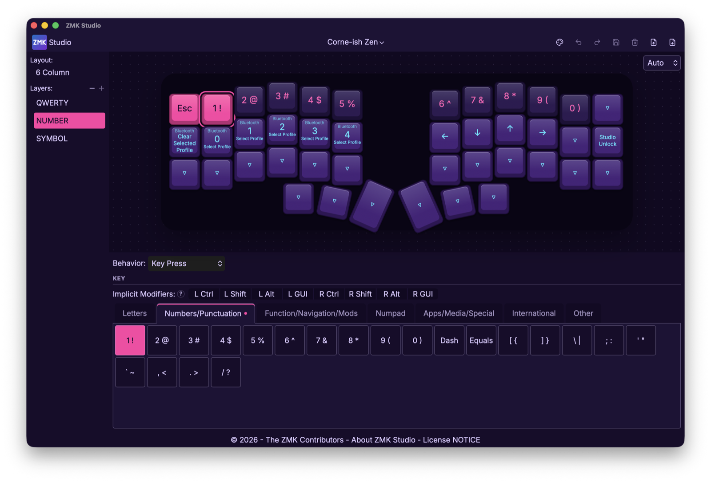
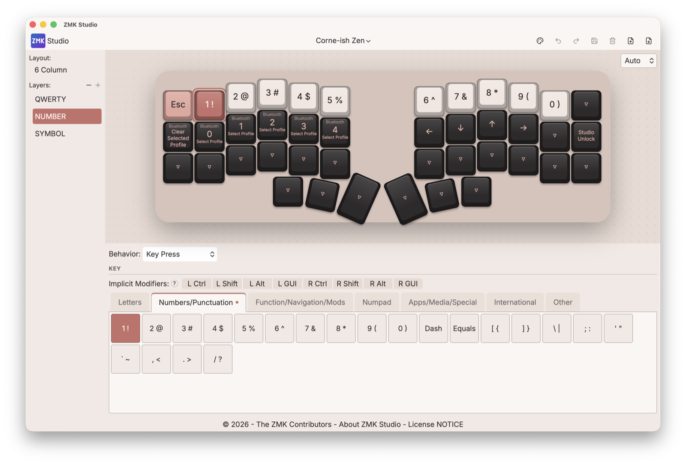

# ZMK Studio DcpEdit

An **unofficial fork** of [ZMK Studio](https://github.com/zmkfirmware/zmk-studio), the
graphical keymap editor for [ZMK Firmware](https://zmk.dev). It tracks upstream and adds
features that have not landed there.

This project is not affiliated with or endorsed by the ZMK Firmware maintainers. Please
report issues with these additions here, not to the upstream project.

## What's different from upstream

- **Keymap import and export.** Export your current keymap as a `.keymap` file, or import
  one from disk. Imports show a review dialog of what will change, apply with progress,
  and can be undone in one step. The desktop app uses native open/save dialogs.
- **Grid-based key picker.** Choose HID usages from a grid of buttons instead of a text
  input, with the Basic category split into Letters, Numbers + Punctuation, and
  Function + Navigation, plus an International category.
- **Richer key legends.** Every binding is labelled from its behavior metadata, including
  layer-tap, mod-tap and transparent keys, and shifted keycaps show their shifted legend.
- **Themes.** Selectable UI themes, keycap colorways and media-key icons.
- **Better desktop window.** A larger default window that remembers its size and position.

### Screenshots

The Laser and Olivia themes, each with matching keycap colorways:

| Laser | Olivia |
| --- | --- |
|  |  |

## Use it

### In the browser (no download)

Open **<https://dcpedit.github.io/zmk-studio-dev/>** in Chrome or Edge. The web version
connects to your keyboard over Web Serial, or Web Bluetooth on Linux. Firefox and Safari
do not support these APIs.

### Desktop app

Download the latest build for your platform from the
[Releases page](https://github.com/dcpedit/zmk-studio-dev/releases).

The binaries are **not code-signed**, so each OS will warn you once:

- **macOS:** open the DMG and drag the app to Applications. The first launch shows
  "Apple could not verify…". Go to *System Settings → Privacy & Security*, scroll down and
  click **Open Anyway**. Alternatively run this once in Terminal:

  ```bash
  xattr -cr "/Applications/ZMK Studio DcpEdit.app"
  ```

- **Windows:** SmartScreen will say the publisher is unknown. Click **More info**, then
  **Run anyway**.
- **Linux:** `chmod +x` the AppImage and run it, or install the `.deb`.

The app installs as "ZMK Studio DcpEdit" with its own bundle identifier, so it can live
alongside the official ZMK Studio without overwriting it.

Your keyboard needs firmware built with
[ZMK Studio support](https://zmk.dev/docs/features/studio) enabled, exactly as for the
official app.

## Build from source

Requirements: Node.js (LTS), and for the desktop app a
[Tauri 2 toolchain](https://v2.tauri.app/start/prerequisites/) (Rust stable plus the
platform dependencies).

```bash
npm ci
npm run dev          # web app at http://localhost:5173
npm run tauri dev    # desktop app
npm run tauri build  # desktop bundles in src-tauri/target/
```

## Releasing

Pushing a tag such as `v0.4.0` runs the `tauri-build` workflow, which builds macOS
(universal), Windows, Linux x64 and Linux arm64 bundles and attaches them to a **draft**
GitHub Release. Review the draft, then publish it. Pushes to `dev` deploy the web app to
GitHub Pages.

Bump `version` in `package.json`, `src-tauri/tauri.conf.json` and `src-tauri/Cargo.toml`
before tagging. Keep the version numeric (`X.Y.Z`); the Windows installer does not accept
pre-release suffixes.

## License

Apache 2.0, the same as upstream. See [LICENSE](LICENSE) and [NOTICE](NOTICE). ZMK is a
trademark of the ZMK Firmware project; this fork uses the name only to describe what it is
a fork of.
